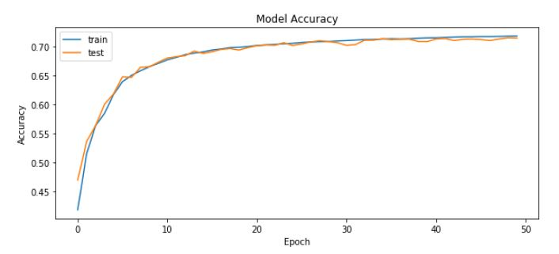
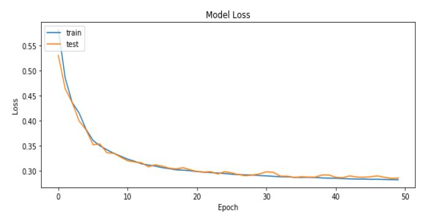
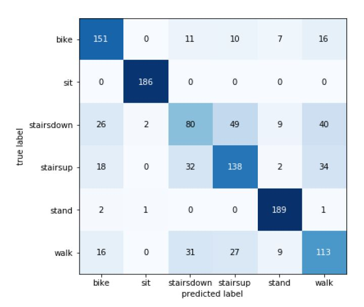
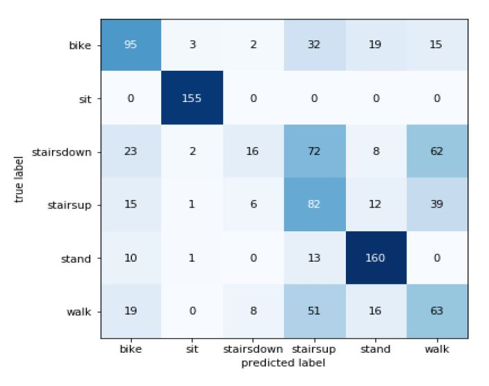

# human-activity-recognition-pytorch
Recognise a human activity from a wide range of possiblities using a Deep Learning Neural Network

## Goal:
To recognize variety and wide range of activities performed by humans, using data collected from a combination of sensors from smartphone and smartwatch devices.

## Implementation:
Have implemented deep learning concepts and developed two models with Feed Forward Fully Connected Network and Recurrent Neural Network adaptive frameworks. Fuse the inputs from two sensors – accelerometer and gyroscope of smartphone and smartwatch, which is in turn feed in to train the models. Later we used cross visualization technique to evaluate the efficiency of the models

## Accuracy and hyperparameters tuning:
Accuracy of FNN model - 56.22% of model accuracy by tuning with the below hyper parameters.
Recurrent Cycle - 1
Neurons – 10
Epochs – 50
Learning Rate – 0.01

## Model Performance and results:

### Model Accuracy

### Model Loss

### Confusion Matrix FNN

### Confusion Matrix RNN

Please refer to the research paper(unpublished) Heterogeneous Human Activity Recognition with Dynamic Sensor Fusion using Deep Learning Models.pdf for futher explanation. 

##Contributions:
1. <a href= "https://github.com/BhuvaneshRavi">Bhuvaneshwaran Ravi</a>
2. <a href= "https://github.com/serlintamilselvam">Serlin Tamilselvam</a>
3. <a> Jayashree Srinivasan </a>
